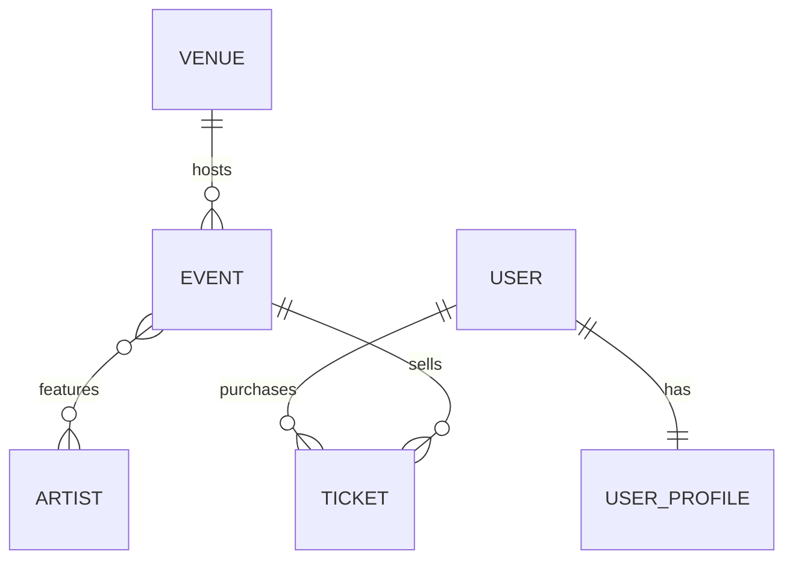

# PulsePass — Taller de Persistencia

Plataforma académica de eventos, artistas y entradas. Caso de estudio enfocado en la **capa de persistencia** con Java 21, Spring Boot 4, JPA/Hibernate, PostgreSQL, Flyway y Testcontainers.

---

##  Modelo de dominio

| Relación | Cardinalidad | Descripción |
|----------|--------------|-------------|
| Venue → Event | 1:N | Un venue alberga muchos eventos |
| Event ↔ Artist | N:M | Un evento tiene varios artistas y viceversa |
| User ↔ UserProfile | 1:1 | Cada usuario tiene exactamente un perfil |
| User → Ticket | 1:N | Un usuario posee muchos tickets |
| Event → Ticket | 1:N | Un evento emite muchos tickets |



### Enums del dominio

| Enum | Valores |
|------|---------|
| `EventCategory` | MUSIC, SPORTS, TECHNOLOGY, EDUCATION, CULTURE, ENTERTAINMENT |
| `EventStatus` | DRAFT, PUBLISHED, SOLD_OUT, CANCELLED, FINISHED |
| `TicketType` | GENERAL, VIP, BACKSTAGE, STUDENT |
| `TicketStatus` | RESERVED, PAID, CANCELLED, USED |

Todos los enums se persisten como **`EnumType.STRING`** (nunca ordinal) según BR-008.

---

##  Tecnologías

- **Java 21**
- **Spring Boot 4.1.1**
- **Spring Data JPA / Hibernate**
- **PostgreSQL 16**
- **Flyway** (único responsable del esquema)
- **Testcontainers** (PostgreSQL real en tests)
- **Maven**
- **MapStruct** (preparado para futuras extensiones)

---

##  Estructura del proyecto

```
PRD/
├── pom.xml
├── README.md
└── src/
    ├── main/
    │   ├── java/com/example/PRD/
    │   │   ├── PrdApplication.java
    │   │   ├── model/                     # Entidades JPA y enums
    │   │   │   ├── Venue.java
    │   │   │   ├── Event.java
    │   │   │   ├── Artist.java
    │   │   │   ├── User.java
    │   │   │   ├── UserProfile.java
    │   │   │   ├── Ticket.java
    │   │   │   ├── EventCategory.java
    │   │   │   ├── EventStatus.java
    │   │   │   ├── TicketType.java
    │   │   │   └── TicketStatus.java
    │   │   └── repository/                # Spring Data Repositories
    │   │       ├── VenueRepository.java
    │   │       ├── EventRepository.java
    │   │       ├── ArtistRepository.java
    │   │       ├── UserRepository.java
    │   │       ├── UserProfileRepository.java
    │   │       └── TicketRepository.java
    │   └── resources/
    │       ├── application.properties
    │       └── db/migration/              # Migraciones Flyway
    │           ├── V1__create_schema.sql
    │           ├── V2__insert_initial_artists.sql
    │           └── V3__add_streaming_url_to_event.sql
    └── test/java/com/example/PRD/
        ├── FlywayMigrationIT.java
        ├── TestcontainersConfiguration.java
        └── repository/
            ├── VenuePersistenceIT.java
            ├── EventRepositoryIT.java
            ├── EventArtistIT.java
            ├── UserProfileIT.java
            ├── TicketRepositoryIT.java
            └── EventSearchIT.java
```

---

##  Migraciones Flyway

| Migración | Propósito |
|-----------|-----------|
| `V1__create_schema.sql` | Crea las 7 tablas (`venues`, `events`, `artists`, `event_artists`, `users`, `user_profiles`, `tickets`) con PK, FK, UNIQUE, CHECK e índices. |
| `V2__insert_initial_artists.sql` | Inserta el catálogo inicial de artistas: Solar Beat, Neon Waves, Caribbean Sound, Ocean Drive, Digital Pulse. |
| `V3__add_streaming_url_to_event.sql` | Agrega la columna `streaming_url VARCHAR(500)` nullable a `events` sin modificar V1. |

### Reglas de integridad reforzadas en PostgreSQL

| Campo | Regla |
|-------|-------|
| `venues.code` | UNIQUE + NOT NULL |
| `venues.capacity` | CHECK > 0 |
| `events.event_code` | UNIQUE + NOT NULL |
| `events.category` | CHECK IN catálogo |
| `events.status` | CHECK IN catálogo |
| `artists.stage_name` | UNIQUE + NOT NULL |
| `users.username` | UNIQUE + NOT NULL |
| `users.email` | UNIQUE + NOT NULL |
| `user_profiles.user_id` | FK + UNIQUE (1:1) |
| `tickets.ticket_code` | UNIQUE + NOT NULL |
| `tickets.type` | CHECK IN catálogo |
| `tickets.status` | CHECK IN catálogo |
| `tickets.price` | NUMERIC(10,2) CHECK >= 0 |
| `event_artists` | PK compuesta `(event_id, artist_id)` |

---

## Consultas implementadas

### Query Methods derivados

| Repositorio | Método | Requisito |
|-------------|--------|-----------|
| `VenueRepository` | `findByCode` | FR-VEN-001 |
| `EventRepository` | `findByEventCode` | FR-EVT-002 |
| `EventRepository` | `findByStatusOrderByEventDateAsc` | FR-EVT-005 |
| `EventRepository` | `findByVenueCode` | FR-VEN-004 |
| `ArtistRepository` | `findByStageName` | FR-ART-002 |
| `UserRepository` | `findByUsername` | FR-USR-002 |
| `UserRepository` | `findByEmailIgnoreCase` | Sección 14 |
| `UserProfileRepository` | `findByUserId` | FR-USR-003 |
| `TicketRepository` | `findByTicketCode` | FR-TKT-002 |
| `TicketRepository` | `findByUserEmailIgnoreCase` | FR-TKT-006 |
| `TicketRepository` | `findByUserEmailIgnoreCaseAndStatus` | FR-TKT-006 |
| `TicketRepository` | `findByEventEventCodeAndStatus` | FR-TKT-007 |

### Consultas JPQL

| Repositorio | Método | Requisito |
|-------------|--------|-----------|
| `EventRepository` | `findByArtistStageName` | FR-SRC-001 |
| `EventRepository` | `findByCityAndArtist` | FR-SRC-002 |
| `EventRepository` | `findRecommendedEvents` | FR-SRC-003 |
| `ArtistRepository` | `findEventsByArtistStageName` | FR-ART-004 |
| `TicketRepository` | `countByEventCodeAndStatus` | FR-TKT-008 |

**Regla de elección:** las consultas simples y navegaciones de relación usan Query Methods; las que requieren múltiples JOINs, DISTINCT o agregaciones usan JPQL.

---

##  Cómo ejecutar los tests

### Requisito previo

- **Docker Desktop corriendo** (Testcontainers levanta un contenedor PostgreSQL real por cada ejecución de test).

### Comando

```bash
mvn clean test
```

### Qué hace cada ejecución

1. Levanta un contenedor PostgreSQL 16.
2. Flyway aplica `V1`, `V2` y `V3` desde cero.
3. Hibernate valida el esquema (`spring.jpa.hibernate.ddl-auto=validate`) sin crearlo ni modificarlo.
4. Se ejecutan las pruebas de integración contra esa base de datos limpia.
5. Al terminar, el contenedor se destruye.

---

## Cobertura de pruebas

| Test | Criterios cubiertos |
|------|---------------------|
| `FlywayMigrationIT` | QT-001, QT-002 |
| `VenuePersistenceIT` | QT-003 (parcial), QT-009, AC-001 |
| `EventRepositoryIT` | QT-003, AC-002, FR-EVT-005, FR-VEN-004 |
| `UserProfileIT` | QT-004, AC-004 |
| `EventArtistIT` | QT-005, AC-003, FR-ART-004 |
| `TicketRepositoryIT` | QT-006, AC-005, FR-TKT-006 |
| `EventSearchIT` | QT-007, QT-008, AC-007, AC-008 |

**Resultado esperado:** `BUILD SUCCESS`.

---

##  Reglas de negocio clave

- **BR-001 a BR-005**: cardinalidades del modelo.
- **BR-006**: `Ticket` es entidad propia, no un `@ManyToMany` entre `User` y `Event`.
- **BR-007**: precios en `BigDecimal` / `NUMERIC(10,2)`, nunca `float`/`double`.
- **BR-008**: enums persistidos por nombre (`EnumType.STRING`), nunca por ordinal.
- **BR-009**: identificadores de negocio protegidos con `UNIQUE` en PostgreSQL.
- **BR-010**: `SOLD_OUT` no se infiere automáticamente en el MVP.

---

##  Fuera de alcance del MVP

- Autenticación, autorización y roles.
- Pasarela de pagos real.
- Códigos QR y control de acceso físico.
- Reembolsos y chargebacks.
- API REST, capa Service y frontend.
- Inventario por sector y prevención de sobreventa.

---

##  Evolución futura

- `TicketInventory` / `Section` para disponibilidad por zona.
- `Order` y `Payment` para separar compra de ticket.
- `PromoCode`, `CheckIn`, auditoría y optimistic locking.
- Paginación, Specifications y Projections para vistas de cartelera.